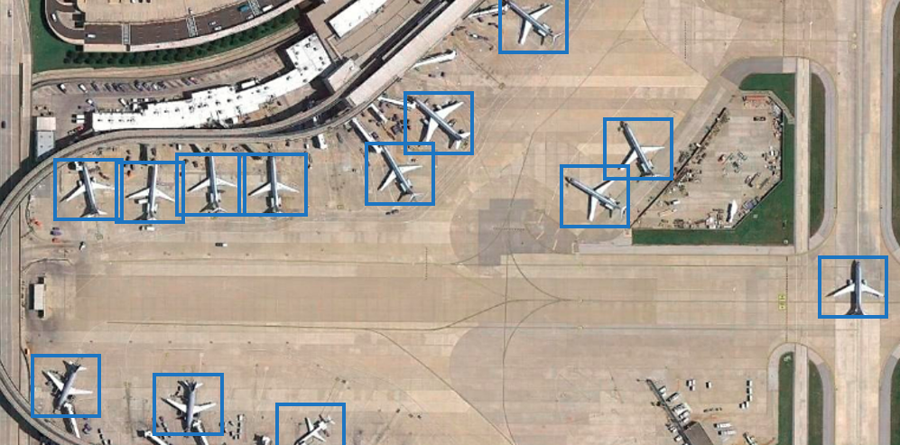

## Personal Blog
[Hadi Abdi Khojasteh](http://hadiabdikhojasteh.ir) personal blog contents that hosted [here](https://virgool.io/@hadiakhojasteh/).

## Contents

How to break a Golestan CAPTCHA system with machine learning

چطوری کپچای سیستم گلستان رو با کمک یادگیری ماشین بشکنیم؟

https://virgool.io/@hadiakhojasteh/how-to-break-a-golestan-captcha-system-with-machine-learning-kukzjnwwsqdx

 

How to build an intelligent car with image processing

هک خودرو؛ چطوری با پردازش تصویر خودرومونو هوشمند کنیم؟

https://virgool.io/@hadiakhojasteh/how-to-build-an-intelligent-car-with-image-processing-rkgz4q8v37xg

 

How to detect airplanes in satellite imagery with convolutional neural networks

چطوری با بینایی کامپیوتر هواپیماها رو در تصویر هوایی پیدا کنیم؟
https://vrgl.ir/2XOI1

## Copyright
Copyright (c) 2018-2021 by Hadi Abdi Khojasteh

## License
GNU General Public License v3.0
